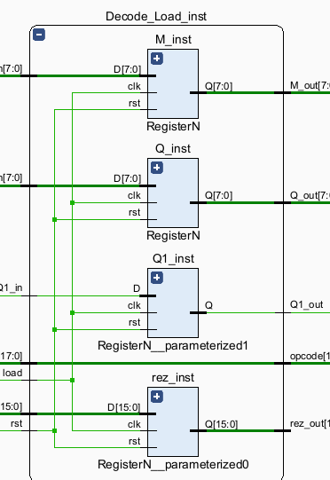
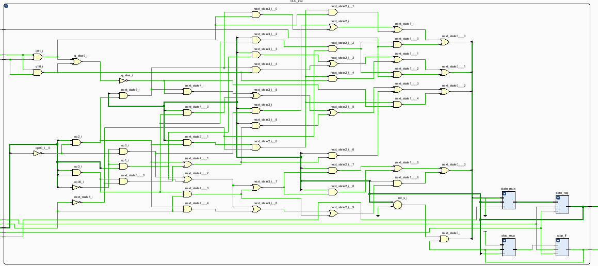

# ALU 8-Bit


## Table of Contents

- [Description](#description)
- [Features](#features)
- [Getting Started](#getting-started)
  - [Prerequisites](#prerequisites)
  - [Installation](#installation)
- [Usage](#usage)
- [Architecture](#architecture)
  - [Modules](#modules)
    - [D Flip-Flop (D Latch)](#d-flip-flop-d-latch)
    - [RegisterN](#registern)
    - [Mux2N / Mux4N](#mux2n--mux4n)
    - [Carry Lookahead Adder (CLA)](#carry-lookahead-adder-cla)
    - [Shifter (Booth & NRD)](#shifter-booth--nrd)
    - [Decoder_Loader](#decoder_loader)
    - [Control Logic Unit (CLU)](#control-logic-unit-clu)
    - [ALU Top Module](#alu-top-module)
- [Simulation](#simulation)

## Description

This project implements and simulates an **8-bit Arithmetic Logic Unit (ALU)** in Verilog using Xilinx Vivado. The ALU supports fundamental arithmetic operations—addition, subtraction, multiplication, and division—leveraging advanced algorithms for performance and structural design.

## Features

- **8-bit Parallel Adder/Subtractor** using a two-stage Carry Lookahead Adder (CLA)
- **Multiplication** via Booth Radix-2 algorithm
- **Division** via Non-Restoring Division (NRD) algorithm
- **Structural Verilog** modules: D flip-flops, parameterized registers, multiplexers, shifters
- **Control Logic Unit (CLU)** to sequence multi-step operations
- Easily extendable to N‑bit architectures by adjusting parameter widths

## Getting Started

### Prerequisites

- [Xilinx Vivado](https://www.xilinx.com/products/design-tools/vivado.html)
- Verilog/SystemVerilog support in your toolchain

### Installation

1. Clone the repository:
   ```bash
   git clone https://github.com/Grin1234/ALU-8-bit.git
   cd ALU-8-bit
   ```
2. Open the Vivado project or synthesize the top-level `alu_8bit` module.

## Usage

The ALU expects an **18-bit input code** formatted as follows:

```
[ Q (8 bits) ] [ M (8 bits) ] [ opcode (2 bits) ]
```

- **Opcodes**:
  - `00` &rarr; Addition
  - `01` &rarr; Subtraction
  - `10` &rarr; Multiplication
  - `11` &rarr; Division

**Example**:

```text
Input code: 00001010 00000101 10
  Q = 00001010 (10)
  M = 00000101 (5)
  opcode = 10   (Multiplication)
```

## Architecture

At the top level, the **ALU** integrates:

- **Decoder_Loader**: parses the 18-bit input and loads registers
- **Control Logic Unit (CLU)**: a finite-state machine driving operation flow
- **Carry Lookahead Adder/Subtractor (CLA)**: high-speed addition/subtraction
- **Shifters**: parameterized 4‑input shifts for Booth and NRD
- **Registers**: N‑bit storage built from D flip-flops
- **Counter**: tracks iteration steps for multi-cycle algorithms


### Modules

#### D Flip-Flop (D Latch)


A level-sensitive D latch used as the fundamental storage element. Enables easy bit-level control and debugging.

#### RegisterN


Parameterizable N-bit register built from D flip-flops via a generate loop.

#### Mux2N / Mux4N

 


Width-parameterized multiplexers for structural routing in the control unit and shifters.

#### Carry Lookahead Adder (CLA)

Implements an 8-bit adder using two 4-bit CLA blocks. Calculates propagate/generate signals to achieve high-speed computation.


#### Shifter (Booth & NRD)

Parameterizable 4-input shifter modules to perform arithmetic shifts required by Booth Radix-2 and Non-Restoring Division algorithms.


#### Decoder_Loader

Parses the incoming 18-bit code, separates operands and opcode, and loads data into registers.




#### Control Logic Unit (CLU)

A one-hot FSM that generates control signals based on opcode, current state, and iteration counters.




#### ALU Top Module

Integrates all sub-modules and orchestrates data flow for arithmetic operations.

## Simulation

1. Launch Vivado Simulator or your preferred Verilog testbench runner.
2. Apply test vectors in the top-level testbench (`alu_tb.v`).
3. Observe waveforms for `Q`, `M`, `opcode`, and `result` signals.

